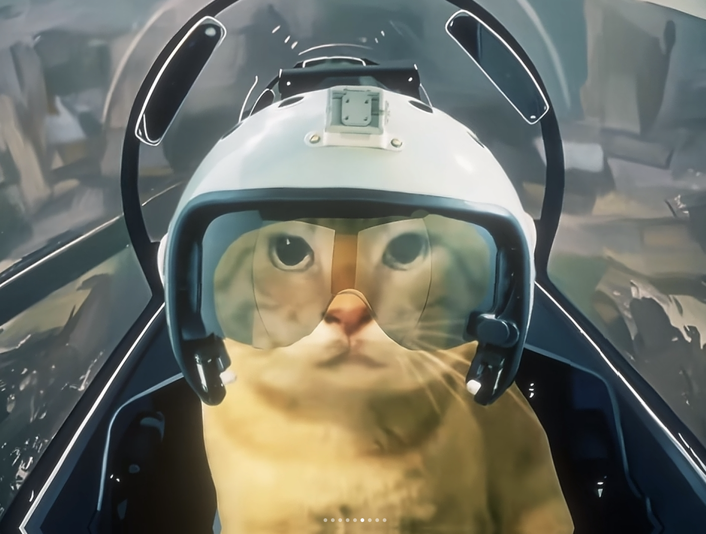

  <!-- 动态打字效果 -->
  

  <!-- 个人头像 -->
  

  <!-- 个人信息 -->
  <h1 id="profile-name" class="text-3xl font-bold">kyc001</h1>
  
计科大一本科生/AI爱好者

  
Think twice,Code Once.

  <!-- 社交链接 -->
  

    <a href="https://github.com/kyc001" target="_blank" class="text-gray-600 hover:text-blue-700"><i class="fab fa-github text-xl"></i></a>
    <a href="#" target="_blank" class="text-gray-600 hover:text-blue-700"><i class="fab fa-linkedin text-xl"></i></a>
    <a href="#" target="_blank" class="text-gray-600 hover:text-blue-700"><i class="fab fa-twitter text-xl"></i></a>
    <a href="https://kyc001.github.io/" target="_blank" class="text-gray-600 hover:text-blue-700"><i class="fas fa-globe text-xl"></i></a>
  

  <!-- 分割线 -->
  

## 🚀 关于我
- NKU 24级本科生
- 喜欢AI，数学，物理

## 🛠️ 我的技能

## 💡 精选项目

### Survivors游戏项目
  
这是一个基于C++和Qt框架开发的动作生存类游戏。玩家可以选择不同类型的英雄，在游戏地图中与各种敌人展开战斗。游戏具备丰富的武器系统、角色升级机制，还支持多种控制模式。同时，游戏采用了模块化的设计，便于代码的维护和扩展。  
**技术栈**: C++, Qt, CMake  
[查看项目](https://github.com/kyc001) | [查看源码](https://github.com/kyc001)

### 基于 YOLOv5 的目标检测系统
  
这是一个基于 YOLOv5 的目标检测系统。YOLOv5 是由 Ultralytics 开发的尖端计算机视觉模型，基于 PyTorch 框架，以其易用性、速度和准确性而闻名。该系统可用于各种视觉 AI 任务，包括目标检测、图像分割和图像分类。系统支持多种数据集，如 COCO、Argoverse、Objects365 等，并且提供了图形化界面，方便用户进行操作。  
**技术栈**: Python, PyTorch, YOLOv5, OpenCV  
[查看项目](https://github.com/kyc001/aimbot-on-yolov5) | [查看源码](https://github.com/ultralytics/yolov5)

## 📊 GitHub 统计
  

## 🔭 当前关注
- 🌱 我目前正在学习 计算机视觉/深度学习。
- 👯 我希望在 CV 上进行合作。
- 🤔 我正在寻求 pytorch 的帮助。
- 💬 可以问我关于 物理/数学 的问题。
- 📫 如何联系我: [kyc001@mail.nankai.edu.cn](mailto:kyc001@mail.nankai.edu.cn)

## 🔧 使用工具

## 📈 周编码统计

## 📫 联系我
- 邮箱: [kyc001@mail.nankai.edu.cn](mailto:kyc001@mail.nankai.edu.cn)
- GitHub: [kyc001](https://github.com/kyc001)
- 个人网站: [https://kyc001.github.io/](https://kyc001.github.io/)

## 📝 格言
> "Think twice, Code once."

  
  
© 2025 kyc001. 基于 GitHub Markdown 构建.

